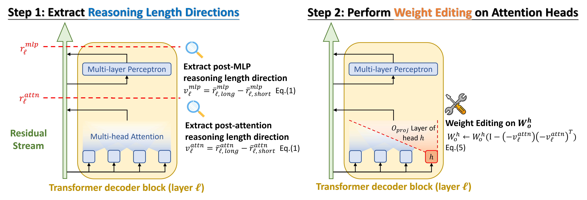

# ThinkEdit

This is the official repository for the paper: **[ThinkEdit: Interpretable Weight Editing to Mitigate Overly Short Thinking in Reasoning Models](https://arxiv.org/abs/2503.22048)**.

## Overview

<p align="center">
  
</p>

## Set Up

```bash
pip install -r requirements.txt
```

If you want to skip all the steps and directly access the resulting output files, you can install Git Large File Storage (LFS) to download the large result files. If Git LFS is not installed, run:

For Ubuntu/Debian:
```bash
sudo apt-get install git-lfs
```
For macOS (using Homebrew):
```bash
brew install git-lfs
```
Then set up Git LFS and pull the large files:
```bash
git lfs install
git lfs pull
```

## Steer Along the Reasoning Length Direction

### Generate Responses for Probing from GSM8K

First, collect responses from reasoning models and store them in the `responses/` directory. (We have already provided the results, so this step is optional.)

```bash
python generate_response_gsm8k.py
```

Specify the `--model` argument: `deepseek-qwen-1.5b`, `deepseek-llama3-8b`, or `deepseek-qwen-14b`.

### Extract the Reasoning Length Direction

Next, extract the layerwise directions from the Self-Attention or MLP modules and store them in the `directions/` directory. (We have provided these files already.)

```bash
python extract_thinking_length_directiongsm8k_attn.py
python extract_thinking_length_directiongsm8k_mlp.py
```

Specify the `--model` argument: `deepseek-qwen-1.5b`, `deepseek-llama3-8b`, or `deepseek-qwen-14b`.

### Steer the Reasoning Length of the Models

Finally, steer the models using the extracted directions and observe changes in accuracy and reasoning length.

To evaluate 200 test examples from GSM8K and store results in `gsm8k_all_layer_thinking_length_steering_results/`:

```bash
python thinking_length_steering_gsm8k.py
```

Arguments:
- `--model`: `deepseek-qwen-1.5b`, `deepseek-llama3-8b`, `deepseek-qwen-14b`
- `--control`: `thinking_length_attn`, `thinking_length_mlp`
- `--direction_weight`: values from `-0.08` to `0.08` (as used in the paper)

Similarly, to evaluate 140 Level-5 examples from MATH and store results in `math_level5_all_layer_thinking_length_steering_results/`:

```bash
python thinking_length_steering_math_level6.py
```

Specify arguments accordingly.

To steer only one layer at a time and store results in `gsm8k_layerwise_thinking_length_steering_results/`:

```bash
python thinking_length_layerwise_steering_gsm8k.py
```

Specify:
- `--layer` to select the layer
- `--direction_weight` set to `-1` or `1` (as used in the paper)

> **Note:** Running layerwise analysis can take considerable time. We suggest using `automate_layerwise_steering_jobs.sh` to manage the jobs (modify based on your hardware).

## ThinkEdit Models: Weight Editing Short Reasoning Heads

### Find the Short Reasoning Heads

Identify short reasoning heads by calculating each head's contribution to the short reasoning direction:

```bash
python find_short_thinking_attn_heads.py
```

Specify the `--model` argument: `deepseek-qwen-1.5b`, `deepseek-llama3-8b`, or `deepseek-qwen-14b`.

This outputs:
- A list of short reasoning heads
- A heatmap figure of each head's contribution

### Perform Weight Editing

Edit the `o_proj` layer of short reasoning heads and save the modified models under `ThinkEdit_models/`:

```bash
python get_ThinkEdit_models.py
```

Specify the `--model` argument accordingly.

Pre-edited ThinkEdit models are also available on Hugging Face:
- `cesun/ThinkEdit-deepseek-qwen-14b`
- `cesun/ThinkEdit-deepseek-llama3-8b`
- `cesun/ThinkEdit-deepseek-qwen-1.5b`

(You can skip this step and directly use the Hugging Face models.)

### Evaluate the Performance of ThinkEdit Models

Evaluate the original and ThinkEdit models and store results under `ThinkEdit_model_evaluation_results/`.

Using vLLM for faster evaluation:

```bash
CUDA_VISIBLE_DEVICES={your available GPUs} python evaluate_ThinkEdit_models.py
```

Arguments:
- `--model`: original (`deepseek-qwen-1.5b`, `deepseek-llama3-8b`, `deepseek-qwen-14b`) or ThinkEdit (`ThinkEdit-deepseek-qwen-14b`, `ThinkEdit-deepseek-llama3-8b`, `ThinkEdit-deepseek-qwen-1.5b`)
- `--dataset`: `gsm8k`, `mmlu_elementary_math`, `MATH-500`, `MATH-level1`, `MATH-level5`
- `--n_samples`: Set to `10` (each question evaluated 10 times)
- `--tensor_parallel_size`: Should match your number of GPUs (recommend 4)

After obtaining all evaluation results, generate plots and tables by running:

```bash
python analyze_ThinkEdit_performance.py
```

## Cite This Work

If you find this work helpful, please cite:

```bibtex
@article{advllm,
   title={ThinkEdit: Interpretable Weight Editing to Mitigate Overly Short Thinking in Reasoning Models},
   author={Chung-En Sun, Ge Yan, Tsui-Wei Weng},
   journal={arXiv},
   year={2025}
}
```